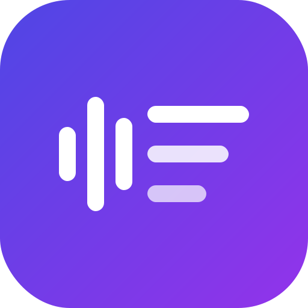

<p align="center">
  
</p>

<h1 align="center">Transcribe</h1>

<p align="center">
  Live, <b>offline</b> transcription of meetings, calls and videos for <b>Android</b> and <b>Windows</b>.<br>
  Malay, English and 97 more languages. Nothing leaves your device.
</p>

## ⬇️ Download

Click a file name to download the latest version:

| Device | Download |
|---|---|
| **Android** (Samsung Galaxy S25 and almost every phone from the last 7 years) | [**Transcribe-android-arm64.apk**](https://github.com/mrameow/Transcribe/releases/latest/download/Transcribe-android-arm64.apk) |
| Android (very old / low-end phones) | [Transcribe-android-arm32.apk](https://github.com/mrameow/Transcribe/releases/latest/download/Transcribe-android-arm32.apk) |
| **Windows 10/11** (installer) | [**Transcribe-windows-setup.exe**](https://github.com/mrameow/Transcribe/releases/latest/download/Transcribe-windows-setup.exe) |
| Windows (portable, no install) | [Transcribe-windows-portable.zip](https://github.com/mrameow/Transcribe/releases/latest/download/Transcribe-windows-portable.zip) |

All versions are listed on the [Releases page](https://github.com/mrameow/Transcribe/releases).

- **Android:** open the APK and allow "Install unknown apps" when asked. If Play Protect warns you, tap **Install anyway**.
- **Windows:** run the setup file. If SmartScreen says "Windows protected your PC", click **More info → Run anyway**. The app isn't from the Microsoft Store, so Windows doesn't recognise it.

## Features

- **Runs on your device.** Speech recognition uses [sherpa-onnx](https://github.com/k2-fsa/sherpa-onnx). No audio or text is sent anywhere.
- **Works offline.** The only internet use is a one-time download of a speech model.
- **Listens to meetings and videos:** Google Meet, Zoom, Teams, YouTube, or the microphone.
- **Malay + English** (or any mix of 99 languages). Each sentence is written in the language it was spoken in.
- **Saves automatically** as timestamped `.txt` files, in a folder you choose.

## How to use

1. Open the app and tap the **download icon** (top right). Download a model (see below). This is the only step that needs internet.
2. Choose the audio source:
   - **System audio** (Windows) / **Other apps** (Android): what the device is playing.
   - **Microphone**: you, or a room.
3. Tap the **languages button** and pick every language that will be spoken, e.g. **Malay + English**.
4. Press **Start**, then go to your meeting or video. On Android, accept the "start recording or casting" prompt. A notification shows while it listens.
5. Press **Stop**. Use the **folder icon** to see where transcripts are saved, or to **change the folder**.

### Which model should I use?

| Model | Languages | Best for | Download |
|---|---|---|---|
| **Whisper Turbo** | 99, incl. Malay + English | **Most accurate for Malay / English / mixed.** Fast phones (Galaxy S23 or newer) and PCs | 538 MB |
| **Parakeet** | English | **Most accurate English**, very fast | 460 MB |
| Whisper Small | 99 | Mid-range phones | 610 MB |
| Whisper Base / Tiny | 99 | Old phones and PCs | 198 / 111 MB |
| English · Live (accurate / fast) | English | Words appear instantly, lower accuracy | 296 / 122 MB |

**Samsung Galaxy S25:** use **Whisper Turbo** with **Malay + English**. For English-only meetings, **Parakeet** is even more accurate and much faster.

Whisper and Parakeet write a full sentence at a time, usually a few seconds after the speaker pauses. The "Live" models show words instantly but make more mistakes.

### What can be captured

| | Windows | Android |
|---|---|---|
| Google Meet / Zoom / Teams | ✅ System audio | ⚠️ Microphone only (see below) |
| YouTube, video players, browser audio | ✅ System audio | ✅ Other apps (Android 10+) |
| Your own voice | ✅ Microphone | ✅ Microphone |

**Android and calls:** Android doesn't let any app record the audio of voice or video calls (Meet, Zoom, WhatsApp, phone calls). This is an Android rule. For calls on a phone, choose **Microphone** and put the call on **speaker**.

**Windows:** System audio records what plays on your default speakers or headphones. Your own voice isn't included; use **Microphone** if you need it.

### Where transcripts are saved

- **Android:** `Documents/Transcribe` by default (open it in the **My Files** app). You can choose another folder inside **Documents** or **Download**.
- **Windows:** `Documents\Transcribe` by default. You can choose any folder.

To change it, tap the **folder icon → Change folder**.

## Build from source

You need [Flutter](https://docs.flutter.dev/get-started/install) 3.47 or newer.

```bash
flutter pub get
flutter test
flutter build windows --release               # Windows, needs Visual Studio "Desktop development with C++"
flutter build apk --release --split-per-abi   # Android, needs the Android SDK + Java 17
```

GitHub Actions builds every push. Each push to `main` publishes (or updates) the GitHub Release for the version in `pubspec.yaml`, with the APKs, the Windows installer and the portable zip. To release a new version, bump `version:` in `pubspec.yaml`. The Windows installer is made with Inno Setup from `windows/installer/transcribe.iss`.

Release APKs are signed with the debug key. That's fine for installing them yourself, but not for the Play Store.

To run the recognition tests against real models, put the model `.tar.bz2` archives, `silero_vad.onnx`, a 16 kHz `test.wav`, and optionally `ms.wav`/`en.wav` in one folder, then:

```bash
TRANSCRIBE_TEST_ARCHIVES=/path/to/folder flutter test   # on Linux, also set LD_LIBRARY_PATH to sherpa_onnx_linux's linux/x64
```

## How it works

```
Windows: WASAPI loopback / mic (windows/runner/audio_capture.cpp)  ┐
Android: AudioPlaybackCapture / mic (CaptureService.kt)            ┘─► "transcribe/audio" channel
        ─► background isolate: resample to 16 kHz ─► sherpa-onnx
             • streaming zipformer + endpointing          (lib/src/engine.dart)
             • Silero VAD → Whisper / Parakeet per sentence
               (several languages: detect, then re-run in the closest allowed one)
        ─► UI (lib/ui/home_page.dart) + auto-saved .txt
```

| Path | What |
|---|---|
| `lib/src/engine.dart` | Recognition engines, language selection, background isolate |
| `lib/src/model_catalog.dart` | Model list and model-file detection |
| `lib/src/model_manager.dart` | Model download and unpacking |
| `lib/src/transcript.dart` | Transcript files and the save folder |
| `windows/runner/audio_capture.cpp` | WASAPI system-audio / mic capture |
| `android/app/src/main/kotlin/.../CaptureService.kt` | Android foreground capture service |
| `assets/logo.svg` | App logo (source of all icons) |
